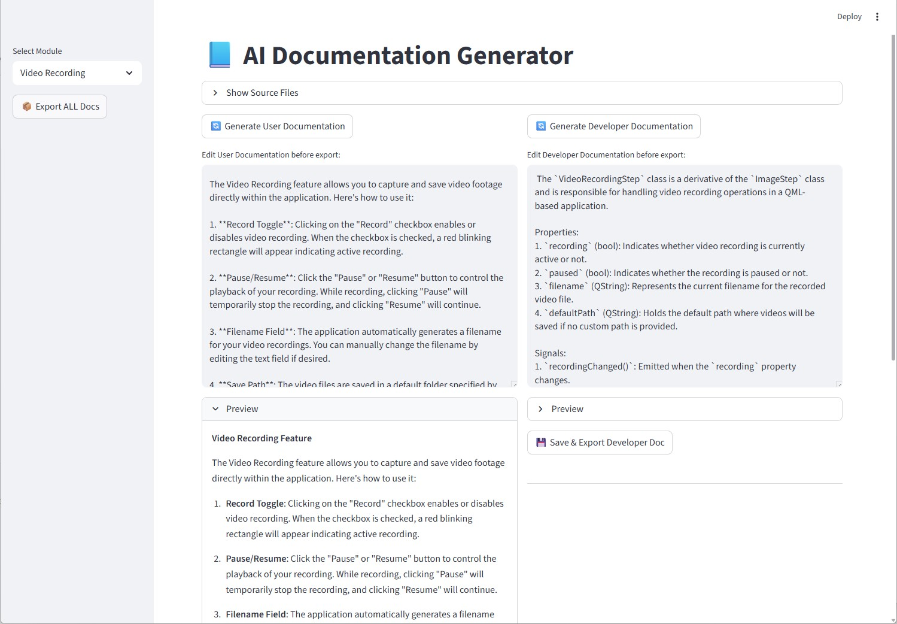

# 📝 AI Documentation Generator

**Automatically creates user-friendly documentation for your software!**  

This app turns source code modules into clear, easy-to-read guides for end users, showing:

- What each feature does  
- How to use the controls  
- The effect on your system  
- Real-world use cases  

All generated documentation can also be edited directly in the App, allowing you to refine descriptions, add examples, or adjust formatting before saving.

---

The input source codes must be located in these directories: 

C++ modules: src/cpp
QML modules / UI components: src/qml

All documentation produced by the generator will be saved in:

docs_generated/